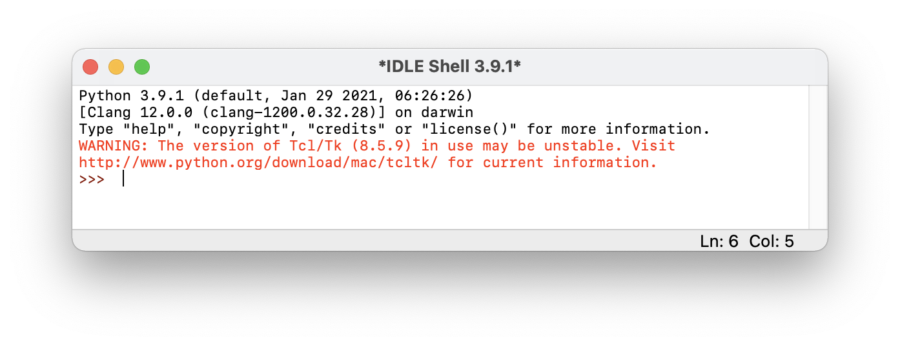

{::nomarkdown}

template: inverse

# Introdução à Linguagem Python



---

<!-- 
- Entrada e saída e expressões - https://drive.google.com/drive/u/1/folders/1-Upp6tNa4wUDOB93kEMD6GpPUw8OA2v1

 -->

# Python

- Python é uma linguagem de programação lançada em 1991 por Guido van Rossum, na Holanda
- Programas escritos em Python são executados pelo **interpretador** Python
- A linguagem evoluiu ao longo do tempo; a versão mais recente é o **Python 3**, que possui diferenças em relação à versão anterior (descontinuada)
- Python é uma das linguagens de programação **[mais populares](https://www.tiobe.com/tiobe-index/)**
- Python é usada por várias empresas e diversos **tipos de projetos**:
  - ciência de dados (ver pandas, numpy)
  - inteligência artificial e machine learning (ver sklearn)
  - web (ver django, flask)
  - sistemas embarcados (ver Raspberry Pi)
  - chat bots
  - jogos (ver pygame)


---

# Como instalar

Baixe a versão mais recente no site oficial: <https://www.python.org/>

Se quiser experimentar sem instalar nada, use algum desses sites:

- <https://codecollab.io/>
- <https://repl.it/>
- <https://brython.info/>
- <http://pythontutor.com/>

---

# Começando a usar

- Você pode usar diversos editores de código-fonte para programar em Python
- Se você instalou o Python no seu computador, ele vem com um editor chamado **IDLE**
- Ao abrir o IDLE, deve aparecer uma janela mais ou menos assim:



---

# Modo shell

- Ao abrir o IDLE, ele abre o **shell** (ou console, ou modo interativo)
- O símbolo `>>>` indica que o interpretador está esperando você digitar alguma instrução na linguagem Python, que será executada imediatamente, e o resultado será exibido
- Experimente digitar:
  - `1 + 1`
  - `r = 5`
  - `3.14 * (r ** 2)`
  - `print("Bem-vindo ao Python")`
  - (A instrução `print` exibe (imprime) algo na tela)
- O modo shell é bom para experimentar e aprender

---

# Modo script

- No modo **script** (ou modo programa), você edita um programa (sequência de instruções) e salva em um arquivo; então, executa o arquivo através do interpretador Python
- Nesse modo, o resultado de expressões matemáticas não é exibido a não ser que você use a instrução `print`
- No IDLE, cliquem em `File` > `New File`. Digite o seguinte:

```python
print(1 + 1)
r = 5
print(3.14 * (r ** 2))
print("Bem-vindo ao Python")
```

- Salve o arquivo como `primeiro.py`
- Pressione F5 ou clique em `Run` > `Run Module`. Você verá a saída do programa na outra janela do IDLE.

---

# Comentários de código

- Dentro de um script Python, linhas começadas por `#` representam comentários: textos que são ignorados pelo interpretador, mas servem para explicar o código para programadores. Exemplo:

```python
# exibe a soma de 2 e 3
print(2 + 3)
```

- Também é possível colocar comentários no final de uma linha de código:

```python
print(2 + 3)   # exibe a soma de 2 e 3
```

---

template: inverse

## Informações adicionais

---

# Editores de código

Você pode usar o IDLE para desenvolver qualquer programa em Python, mas programadores profissionais tendem a preferir outros editores. Algumas opções:

- Visual Studio Code
- PyCharm
- Jupyter Notebook (para ciência de dados)

---

# bytecode

- Interpretar o código-fonte é um processo relativamente lento
- Para melhorar o desempenho dos programas, Python usa uma abordagem híbrida:
  - Na primeira vez em que um programa é executado, o seu código-fonte (arquivo `.py`) é compilado para um código intermediário, chamado *bytecode* (arquivo `.pyc`)
  - O bytecode é então traduzido para código de máquina pelo interpretador Python

---

# Referências

- Nilo Menezes. **Introdução à Programação com Python** (2ª ed.). Novatec Editora.
- Allen B. Downey. **Pense em Python** (2ª ed.). Disponível em <https://penseallen.github.io/PensePython2e/>
- Allen B. Downey. **Pense em Python** (3ª ed.). Disponível em <https://panda.ime.usp.br/pensepy/static/pensepy/>

{:/}
