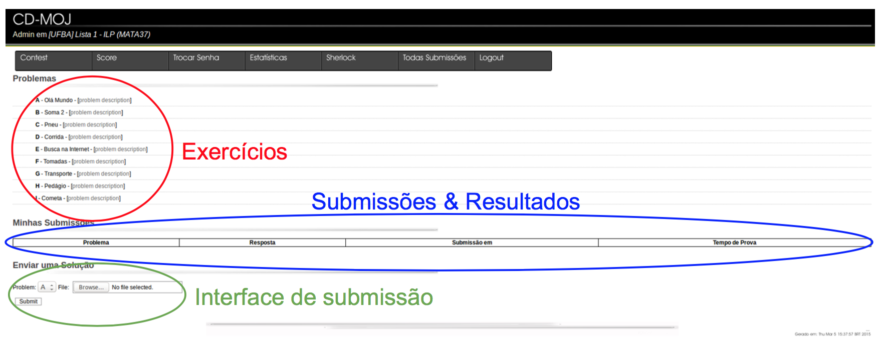
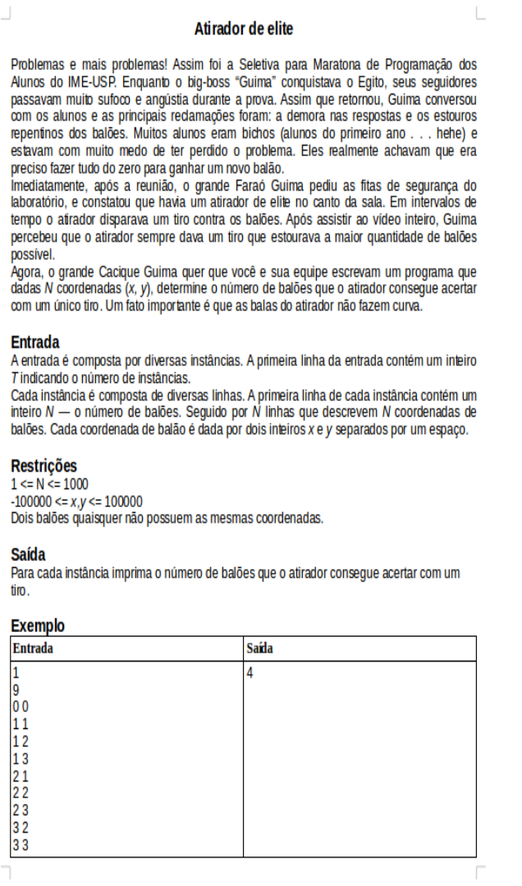
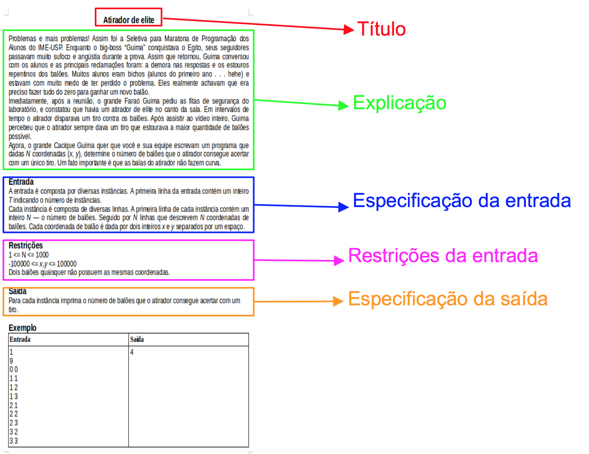

# Sistema usado na disciplina

CD-MOJ (<http://moj.naquadah.com.br/>)

---

# Sistema usado na disciplina

CD-MOJ (<http://moj.naquadah.com.br/>)

---

# Sistema usado na disciplina

CD-MOJ (<http://moj.naquadah.com.br/>)

---

# O que é um problema?

---

---

---

---

---

---

---

---

# Alguns sites de programação competitiva

- [SPOJ](http://br.spoj.com/)
- [Outros](https://medium.com/coderbyte/the-10-most-popular-coding-challenge-websites-of-2016-fb8a5672d22f)

---

# Observações

- Para o MOJ, use a extensão `.cpp`
- Para o MOJ, use o Firefox
- Observe os valores limite das entradas
- Pode ser necessário usar `cout << fixed << setprecision(N) << ...`
- Pode imprimir antes de ler todas as entradas; pode alternar `cin` e `cout`

---

Baseado nos slides do prof. Karl Agüero

