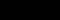

## Semáforo

Nas questões a seguir você usará o Tupy para visualizar o programa sendo executado. Para instalar o Tupy, use o comando `pip install git+https://github.com/rodrigorgs/tupy.git`. Para executar o seu programa, crie um arquivo com extensão `.py`, cole seu código-fonte e execute-o com o Python.

Para facilitar, você pode baixar o código inicial dos exercícios como um [arquivo `.zip`](ex-tupy.zip), já incluindo as imagens.

----

No ambiente **Tupy**, crie uma classe `Semaforo`, com o atributo `cor` e o método `avanca` (avança). O atributo `cor` deve ser inicialmente `"verde"`; ao chamar `avanca` sucessivamente, a cor deve mudar para `"amarelo"`, `"vermelho"`, então voltar para `"verde"` e assim por diante. O atributo `file` (herdando do tupy) deve ser sempre igual à cor, seguida de `.png`.

**Atenção**: ao colar o código aqui (neste e nos próximos exercícios), omita a linha `from tupy import *`.

<textarea class="code lang-python">
#from tupy import *

class Semaforo(Image):
  def __init__(self):
    pass

s = Semaforo()

run(globals())
</textarea>

class Image:
  def __new__(cls, *args, **kwargs):
    self = super().__new__(cls)
    self.x = 0
    self.y = 0
    self.file = self.__class__.__name__.lower() + '.png'
    self.angle = 0
    return self

def run(x):
  pass
[[[code]]]

class Image:
  def __new__(cls, *args, **kwargs):
    self = super().__new__(cls)
    self.x = 0
    self.y = 0
    self.file = self.__class__.__name__.lower() + '.png'
    self.angle = 0
    return self

def run(x):
  pass
[[[code]]]
import unittest
class TestSemaforo(unittest.TestCase):
  def test_cor_inicial(self):
    s = Semaforo()
    self.assertEqual(s.cor, 'verde')
    self.assertEqual(s.file, 'verde.png')
  
  def test_avanca(self):
    s = Semaforo()
    s.avanca()
    self.assertEqual(s.cor, 'amarelo')
    self.assertEqual(s.file, 'amarelo.png')
    s.avanca()
    self.assertEqual(s.cor, 'vermelho')
    self.assertEqual(s.file, 'vermelho.png')
    s.avanca()
    self.assertEqual(s.cor, 'verde')
    self.assertEqual(s.file, 'verde.png')
    s.avanca()
    self.assertEqual(s.cor, 'amarelo')
    self.assertEqual(s.file, 'amarelo.png')

if __name__ == '__main__':
  import sys
  unittest.main(exit=False)

## Sombra

Crie duas classes, `Sombra` e `Pessoa`. A classe `Pessoa` deve possuir um atributo `sombra` que referencia um objeto da classe `Sombra`, recebido como parâmetro no momento da criação do objeto `Pessoa`.

`Pessoa` deve possuir um método `anda`, que recebe como parâmetro o deslocamento da pessoa, em pixels, nos eixos `x` e `y`, respectivamente.

Algumas restrições:

- Ao ser instanciado, um objeto do tipo `Pessoa` deve ter posição inicial x = `100`, y = `320`.
- A sombra deve acompanhar a pessoa, estando sempre 10 pixels abaixo da pessoa, na mesma posição x.
- Pode haver pessoas sem sombra; nesse caso, o atributo `sombra` deve ser `None`.

<textarea class="code lang-python">
#from tupy import *

class Pessoa(Image):
  def __init__(self):
    pass

class Sombra(Image):
  def __init__(self):
    pass

run(globals())
</textarea>

class Image:
  def __new__(cls, *args, **kwargs):
    self = super().__new__(cls)
    self.x = 0
    self.y = 0
    self.file = self.__class__.__name__.lower() + '.png'
    self.angle = 0
    return self

def run(x):
  pass
[[[code]]]

class Image:
  def __new__(cls, *args, **kwargs):
    self = super().__new__(cls)
    self.x = 0
    self.y = 0
    self.file = self.__class__.__name__.lower() + '.png'
    self.angle = 0
    return self

def run(x):
  pass
[[[code]]]
import unittest
class TestSombra(unittest.TestCase):
  def test_posicao_inicial(self):
    pessoa = Pessoa(None)
    self.assertEqual(pessoa.x, 100)
    self.assertEqual(pessoa.y, 320)
  
  def test_pessoa_move_sem_sombra(self):
    pessoa = Pessoa(None)
    pessoa.anda(100, 2)
    self.assertEqual(pessoa.x, 200)
    self.assertEqual(pessoa.y, 322)
    pessoa.anda(50, -3)
    self.assertEqual(pessoa.x, 250)
    self.assertEqual(pessoa.y, 319)

  def test_posicao_inicial_da_sombra(self):
    sombra = Sombra()
    pessoa = Pessoa(sombra)
    self.assertEqual(sombra.x, 100)
    self.assertEqual(sombra.y, 330)

  def test_pessoa_move_com_sombra(self):
    sombra = Sombra()
    pessoa = Pessoa(sombra)
    pessoa.anda(100, 2)
    self.assertEqual(sombra.x, 200)
    self.assertEqual(sombra.y, 332)
    pessoa.anda(50, -3)
    self.assertEqual(sombra.x, 250)
    self.assertEqual(sombra.y, 329)

if __name__ == '__main__':
  import sys
  unittest.main(exit=False)

## Torre de Hanói

Implemente o jogo Torre de Hanói usando o Tupy. O jogo consiste em três torres, cada uma com um número variável de discos, dispostos de forma que o disco menor esteja no topo de cada torre. O objetivo do jogo é mover todos os discos de uma torre para outra, obedecendo as seguintes regras:

- Um disco maior não pode ficar sobre um disco menor.
- Só é permitido mover um disco por vez.
- Só é permitido mover o disco do topo de uma torre.

Você deve criar as seguintes classes:

- `Disco`: representa um disco de tamanho `tamanho`. O atributo `file` deve ser igual a `discoX.png`, onde `X` é o tamanho do disco.
- `Torre`: representa uma torre. A torre deve ser inicializada com uma posição `x` e `y`, e uma lista de discos (atributo `discos`), de baixo para cima. Se não for informada uma lista de discos, supõe-se que a torre está vazia.
  - A torre deve possuir um método `disco_do_topo`, que retorna o disco do topo da torre, ou `None` se a torre estiver vazia. 
  - Além disso, deve possuir um método `move_disco_para_torre`, que recebe como parâmetro uma outra torre, e move o disco do topo da torre atual para o topo da torre recebida como parâmetro, contanto que o movimento não viole as regras do jogo. O método deve retornar `True` se o disco foi movido, ou `False` caso contrário.

Ao mover um disco, sua posição deve ser alterada, de forma que a sua coordenada `x` coincida com a coordenada `x` da torre, e a sua coordenada `y` seja dada por `Ty + 40 - 30 * N`, onde `Ty` é a coordenada `y` da torre de destino, e `N` é o número de discos na torre de destino após o movimento.

Você pode usar os seguintes arquivos de imagem (três discos e uma torre):

<textarea class="code lang-python">
#from tupy import *

class Disco(Image):
  def __init__(self):
    pass

class Torre(Image):
  def __init__(self):
    pass

  def disco_do_topo(self):
    return None

  def move_disco_para_torre(self, destino):
    return False

disco3 = Disco(3)
disco2 = Disco(2)
disco1 = Disco(1)
torre1 = Torre(200, 300, [disco3, disco2, disco1])
torre2 = Torre(300, 300)
torre3 = Torre(400, 300)

run(globals())
</textarea>

class Image:
  def __new__(cls, *args, **kwargs):
    self = super().__new__(cls)
    self.x = 0
    self.y = 0
    self.file = self.__class__.__name__.lower() + '.png'
    self.angle = 0
    return self

def run(x):
  pass
[[[code]]]

class Image:
  def __new__(cls, *args, **kwargs):
    self = super().__new__(cls)
    self.x = 0
    self.y = 0
    self.file = self.__class__.__name__.lower() + '.png'
    self.angle = 0
    return self

def run(x):
  pass
[[[code]]]
import unittest

class TestTorre(unittest.TestCase):
    def setUp(self):
        self.disco3 = Disco(3)
        self.disco2 = Disco(2)
        self.disco1 = Disco(1)
        self.torre1 = Torre(200, 300, [self.disco3, self.disco2, self.disco1])
        self.torre2 = Torre(300, 300)
        self.torre3 = Torre(400, 300)

    def test_move_disco_para_torre(self):
        self.assertTrue(self.torre1.move_disco_para_torre(self.torre2))
        self.assertNotIn(self.disco1, self.torre1.discos)
        self.assertIn(self.disco1, self.torre2.discos)
        self.assertFalse(self.torre1.move_disco_para_torre(self.torre2))

    def test_move_disco_para_torre_checa_posicao(self):
        self.torre1.move_disco_para_torre(self.torre2)
        self.assertEqual(self.disco1.x, 300)
        self.assertEqual(self.disco1.y, 340)
        self.torre1.move_disco_para_torre(self.torre3)
        self.assertEqual(self.disco2.x, 400)
        self.assertEqual(self.disco2.y, 340)
        self.torre2.move_disco_para_torre(self.torre3)
        self.assertEqual(self.disco1.x, 400)
        self.assertEqual(self.disco1.y, 310)

    def test_disco_do_topo(self):
        self.assertEqual(self.torre1.disco_do_topo(), self.disco1)
        self.assertIsNone(self.torre2.disco_do_topo())

class TestDisco(unittest.TestCase):
    def test_init(self):
        disco = Disco(5)
        self.assertEqual(disco.tamanho, 5)
        self.assertEqual(disco.file, "disco5.png")

if __name__ == '__main__':
  import sys
  unittest.main(exit=False)

