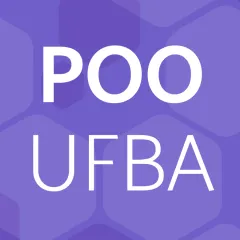

<!-- - [3,0] Pequenos exercícios de código em Python (individual) - exercícios indicados nesta página -->
<!-- 
- [4,0] [Projeto em Python (em equipe)](projeto-jogo-oo) - jogo usando a biblioteca [Pyglet](pyglet)
  - [Código-fonte do exemplo de jogo de cartas](https://github.com/rodrigorgs/cartas-pyglet)
- [3,0] Prova escrita sobre programação orientada a objetos com Java (individual) -->

<!-- - [4,0] Projeto em Python (em equipe) - [sopa de letrinhas](sopa-de-letrinhas) usando a biblioteca [Pyglet](pyglet) -->

<!-- 
## Lista de exercícios (vale nota)

1. **[Python básico](ex-python-intro)**
2. **[Funções em Python](ex-python-funcoes)**
3. **[Classes](ex-python-oo)**
4. **[Rede social](ex-python-rede-social)**
5. **[Propriedades](ex-python-oo2)**
6. **[Exceções](ex-python-excecoes)**
7. **[Membros estáticos](ex-python-static)**
8. **[Enums](ex-python-enum)**
9. **[Herança](ex-python-heranca)**
10. **[Herança: parte 2](ex-python-heranca2)**
 -->

## Guia de Laboratório

Acesse o [guia de laboratório](https://docs.google.com/document/d/1ijCP-ONUL9IJOrTGYhejdkp2pIxRodRHWdH8XkPJjn4/edit#)

## Conteúdo

<!-- 
**Introdução: paradigmas de linguagens de programação e programação orientada a objetos**

 -->

- **Introdução à linguagem Python**
  - [Revisão da linguagem Python](/aulas/ilp) (if, while, for, funções, listas etc.)
  <!-- - [Funções](intro-funcoes-py): parâmetros, retorno, funções tagarelas -->
  - [Variáveis, objetos (valores) e tipos (classes)](intro-objetos-py)
  - [Variáveis e funções](funcoes-variaveis): escopo, variáveis locais e globais, sombreamento, reatribuição e passagem de objetos mutáveis como parâmetro
  - [Recursos extras de funções em Python](funcoes-python): parâmetros *default*, argumentos nomeados e docstrings
  - [Módulos e pacotes][modulos-pacotes]
  - **Listas de exercícios 1 e 2**
- **Programação orientada a objetos - parte 1**
  - [O paradigma da programação orientada a objetos][paradigma-oo]
  - POO básico: objetos, classes, atributos, métodos, construtores
    - [O ambiente Tupy para aprendizagem de POO][tupy-poo]
    - [POO básico em Python][poo-basico-py]
    - [Criando classes no ambiente Tupy][tupy-classes]
    - **Listas de exercícios 3 e 4**
  - [Modelagem OO](https://engsoftmoderna.info/cap4.html)
  - [Tipagem estática][tipagem-estatica]
- **Programação orientada a objetos - parte 2**
  - [Encapsulamento, visibilidade e propriedades][encapsulamento]
  - [Sobrecarga de operadores][sobrecarga]
  - [Exceções][excecoes]
  - [Static][static] e [Enum][enum]
  - [Herança e polimorfismo][heranca]
    <!-- - [Identidade e mutabilidade](identidade-mutabilidade) -->

[modulos-pacotes]: https://docs.google.com/presentation/d/1GoTn5Lpbov0xz30Di9rlbcOHpmL5upBVEqRwM-lYQg8/edit
[paradigma-oo]: https://docs.google.com/presentation/d/1bdzbS51fA-BewCaC0gMNuTSQWtDXfrHKVRiR3I-URnY/edit
[tupy-classes]: https://docs.google.com/presentation/d/1h-w_iZPu2PcXdmUWFdPPOgvRduvZn-VBgFDo5l2tfUw/edit
[tupy-poo]: https://docs.google.com/presentation/d/1tIi4g7ljCe2Ri1Ijm0tATZF8NrLgo1jedL_Q6wRifKc/edit
[poo-basico-py]: https://docs.google.com/presentation/d/19bN5IqfxQADgGKLlZ67mLPuQLYC_SKAtltJCNSKzkdE/edit
[encapsulamento]: https://docs.google.com/presentation/d/14DtBOvTD-30YsbB5CpDTKU-E0GYdhxV0Mpwd_8WGc6U/edit
[enum]: https://docs.google.com/presentation/d/1g59YNwbirJTdeCS27CGqPsMJ6wr8wvoIKzaJsb2x5kQ/edit
[static]: https://docs.google.com/presentation/d/1UrWfmWoLe9xsb5WmU2mMCHw0AEWOqiRgO_AbyNpvQ_0/edit
[excecoes]: https://docs.google.com/presentation/d/1U_JjTZZTQ9XruyLxnIlgKxmB5HkmK9gUOaOsCQZ42e8/edit
[tipagem-estatica]: https://docs.google.com/presentation/d/1g7fK2N1sYmhBoHAMI2oJEE7qewbF_ve-DAtZ9e9z1rM/edit
[sobrecarga]: https://docs.google.com/presentation/d/1UfZ7swOojM6QOnZa5mA9VCZmvby1Dd9bniIOuaiPYI0/edit
[heranca]: https://docs.google.com/presentation/d/1DG7HM7MFKisSS8QXRI-J0FhLXay4Hx2CJl2-Wca7SQE/edit

<!-- 

- Revendo Python sob o ponto de vista da programação orientada a objetos: 
  - [Objetos, referências, identidade, mutabilidade](intro-objetos-py)
- Programação procedural (programa construído a partir de funções)
  - [Construindo programa procedural a partir de uma especificação](funcoes-exemplo-py): especificação, refatoração, diagramas
- Outros tópicos em Python
  - Manipulando arquivos

**Parte 2: programação orientada a objetos com Python**

- Importância: as principais linguagens de programação são orientadas a objetos. Ver ranking do [TIOBE](https://www.tiobe.com/tiobe-index/) e [PYPL](https://pypl.github.io/PYPL.html)
- Conceitos básicos de orientação a objetos: [1](https://docs.google.com/presentation/d/1bNv_WTRK7ncIDEkAWZ3q2WdZu5vi5Ran-8gT_As1c8A/edit) e [2](projeto-oo)
- Classes, objetos, métodos, atributos e construtores: [1](https://docs.google.com/presentation/d/19bN5IqfxQADgGKLlZ67mLPuQLYC_SKAtltJCNSKzkdE/edit) e [2](definindo-classes)
- [Membros estáticos](https://docs.google.com/presentation/d/1UrWfmWoLe9xsb5WmU2mMCHw0AEWOqiRgO_AbyNpvQ_0/edit)
- [Enums](https://docs.google.com/presentation/d/1g59YNwbirJTdeCS27CGqPsMJ6wr8wvoIKzaJsb2x5kQ/edit)
- [Sobrecarga de operadores](https://docs.google.com/presentation/d/1UfZ7swOojM6QOnZa5mA9VCZmvby1Dd9bniIOuaiPYI0/edit)
- [Herança, polimorfismo](https://docs.google.com/presentation/d/1DG7HM7MFKisSS8QXRI-J0FhLXay4Hx2CJl2-Wca7SQE/edit?usp=sharing)
- [Exceções](https://docs.google.com/presentation/d/1U_JjTZZTQ9XruyLxnIlgKxmB5HkmK9gUOaOsCQZ42e8/edit)
- [Tipagem estática](https://docs.google.com/presentation/d/1g7fK2N1sYmhBoHAMI2oJEE7qewbF_ve-DAtZ9e9z1rM/edit)

**Parte 3: Java**

- [Programação procedural em Java](aula-java-programacao)
- Construtores
- Visibilidade
- Static e final
- Herança, classes abstratas e interfaces

<!-- - [Construindo um programa OO a partir de uma especificação](exemplo-classes) -->
<!-- - [Usando objetos](usando-objetos): objetos, atributos, métodos -->

**Material complementar**: [Diferenças entre Java e Python](https://docs.google.com/presentation/d/1zKDn5ifd4CCN3o8ZqlgOlS-sWF78BRTyMURRX5Crnmw/edit)

<!--
| Categoria | Conteúdo                                                                           |
|-----------|------------------------------------------------------------------------------------|
| Intro     | [Introdução à programação orientada a objetos][intro]                              |
| .         |                                                                                    |
| Java      | [Eclipse, uma IDE para Java][eclipse]                                              |
| Java      | [Alô mundo, pacotes](aula-java-alomundo)                                           |
| Java      | [Programação procedural em Java](aula-java-programacao) (com exercícios)           |
| Java      | [Ecossistema Java: Javadoc, Maven](aula-java-ecossistema) (javadoc, maven)         |
| Java      | [Referências, identidade e igualdade][referencias].                                |
| .         |                                                                                    |
| OO        | [Classes, atributos, métodos](aula-java-oo2)                                       |
| OO        | [Classes, atributos, métodos, construtores, this](aula-classes)                    |
| OO        | [Orientação a objetos básica (static e final)](aula-java-oo)                       |
| .         |                                                                                    |
| OO        | [Classes, construtores, garbage collector, this][construtores]                     |
|           | - [Quiz][quiz1]                                                                    |
| Java      | [Sobrecarga (overload)](aula-overload)                                             |
| Java      | [Enums](aula-enums) -- exemplo: [cartas de baralho](cartas)                        |
| OO        | Encapsulamento: [Pacotes, modificadores de acesso, getters e setters](aula-acesso) |
|           | - [Quiz][quiz2]                                                                    |
| .         |                                                                                    |
| Java      | [Collections](aula-collections)                                                    |
| Java      | [Exceções](aula-excecoes)                                                          |
| OO        | Encapsulamento: [Imutabilidade e referências escapando](aula-imutabilidade)        |
| .         |                                                                                    |
| OO        | [Herança](aula-heranca-parte1.md).                                                 |
| OO        | .. [Sobreposição](aula-heranca-parte2.md)                                          |
| OO        | .. [Polimorfismo](aula-heranca-parte3.md)                                          |
| OO        | .. [Classes e métodos abstratos](aula-heranca-parte4.md)                           |
| OO        | [Tipos e interfaces](aula-interfaces)                                              |
| .         |                                                                                    |
| OO        | [Generics](aula-generics).                                                         |
| OO        | [Classes internas](aula-classes-internas).                                         |
| OO        | Reflection, annotations                                                            |
| Skills    | Debugging                                                                          |
| Skills    | Controle de versão                                                                 |
| Skills    | Testes de unidade                                                                  |
| Skills    | [Refatoração](aula-refactoring)                                                    |
| OO        | [Modelagem conceitual](aula-modelagem)                                             | 
| OO        | UML: diagramas de classes e de objetos                                                            | 

[intro]: https://docs.google.com/presentation/d/1bdzbS51fA-BewCaC0gMNuTSQWtDXfrHKVRiR3I-URnY/edit
[eclipse]: https://docs.google.com/presentation/d/1BohOI0Ky0cqwsze7U-PnJc_qU9u9dbKtvUOwiH63HIY/edit?usp=sharing
[referencias]: https://docs.google.com/presentation/d/13w59yenVXOT4vXk14c5-JMgP62ty3LPkBHCMpwk61zM/edit
[construtores]: https://docs.google.com/presentation/d/1U1eChwz2O0TnrF04DiUQ5fEANGflUVdCPtR_azmNgdo/edit
[acesso]: https://docs.google.com/presentation/d/1MRqTOvbEnzAspcvW8_wWkKZSNJU1a6l3TVGTGSjkvMQ/edit
[quiz1]: https://create.kahoot.it/details/programacao-orientada-a-objetos-com-java-parte-1/93655e8b-0866-41fa-ba09-439c8709cc8b
[quiz2]: https://create.kahoot.it/details/programacao-orientada-a-objetos-parte-2/3ef15af5-873c-40e9-bb1e-1a6a7316fcc7
 -->
<!-- 
Alguns slides disponíveis no [Drive da disciplina](https://drive.google.com/open?id=1JxHnqlfg74vCFhJf1LfS3d4w70Ev8qBN)

Outros slides ou notas de aula:

- [Herança parte 1](aula-heranca-parte1)
- [Herança parte 2 (sobreposição)](aula-heranca-parte2)
- [Herança parte 3 (polimorfismo)](aula-heranca-parte3)
- [Herança parte 4 (classes abstratas e interfaces)](aula-heranca-parte4)
- [Refatoração](aula-refactoring)
- [Enums](aula-enums)
- [Exceções](aula-excecoes)
- [Classes internas](aula-classes-internas)
- [Generics](aula-generics)

# Bibliografia recomendada

Os livros a seguir estão disponíveis nas bibliotecas da UFBA:

- SANTOS, Rafael. Introdução à programação orientada a objetos usando Java. Rio de Janeiro, RJ: Elsevier, c2003. 319, [6] p. ISBN 9788535212068 (broch.).
- DEITEL, Harvey M.; DEITEL, Paul J. Java: como programar. 8.ed. São Paulo, SP. Pearson Prentice Hall, 2010. xxix 1144 p. ISBN 9788576055631(broch.).
- ECKEL, Bruce. Thinking in Java. 2nd ed. Upper Saddle River, NJ: Prentice Hall, 2000. 1127 p. ISBN 0130273635 (broch.). -->
